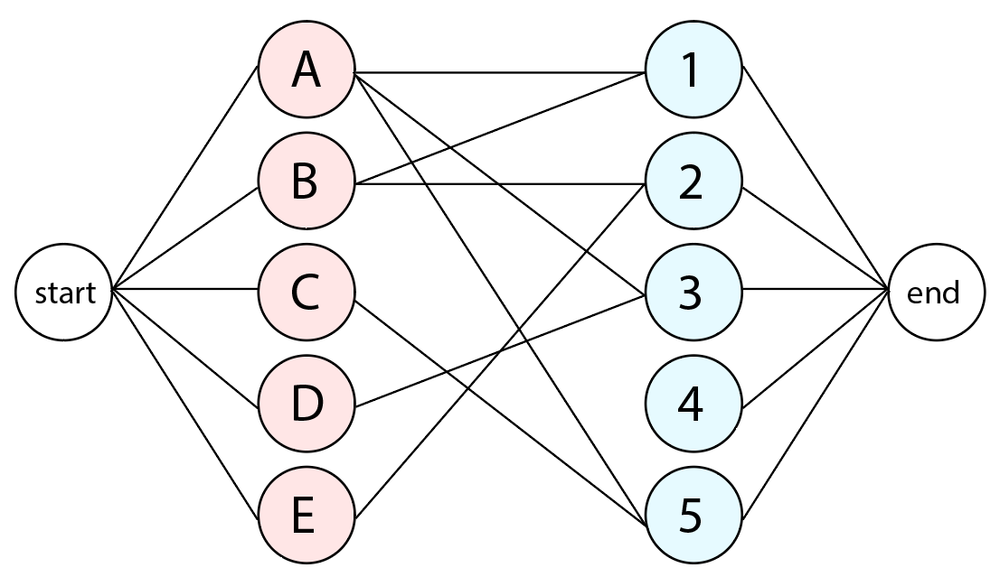

# 이분 매칭 (Bipartite Matching)

한쪽 그룹은 X 그룹, 다른 한쪽 그룹은 Y 그룹이라고 할 때 모든 경로의 방향은 X->Y인 그래프의 최대 유량을 구하는 것



해당 알고리즘 통해 구하고 싶은 것은 <span style="color:red">**최대 매칭 수**</span>  
또한 간선의 용량은 전부 1  
위와 같이 간선 용량이 1인 네트워크 플로우 문제로 이해

[에드몬드 카프 알고리즘](../../최대유량/설명/최대유량.md) 도 가능하지만 이러한 특수한 경우엔 DFS 적용  
더 효율적인 시간복잡도로 처리가 가능  
무려 $O(VE)$

### 블로그 모음들
- [그림적인 설명](https://yjg-lab.tistory.com/209)
- [적절한 그림 + 적절한 코드 블로그 설명](https://blog.naver.com/kks227/220807541506)
- [수학적인 설명도 곁들인](https://byeo.tistory.com/entry/%EC%9D%B4%EB%B6%84-%EB%A7%A4%EC%B9%AD-Bipartite-Matching-%EC%95%8C%EA%B3%A0%EB%A6%AC%EC%A6%98)


## 알고리즘 방식

왼쪽 노드들을 전부 dfs 함수를 실행함

### DFS
1. 먼저 해당 왼쪽 노드를 순차적으로 조사를 시작
2. 현재 조사 중인 왼쪽 노드와 연결된 모든 오른쪽 노드들에 대해서 다 한번씩 조사를 함. 밑의 규칙을 따름
    1. 현재 오른쪽 
    2. 만약 해당 오른쪽 노드가 "매칭이 안된 상태" 인 경우 곧바로 연결하고 즉각 True 리턴(종료)
    3. 만약 해당 오른쪽 노드가 "이미 매칭된 상태" 인 경우, 그 오른쪽 노드랑 매칭되어 있는 왼쪽 노드가
        또다른 오른쪽 노드랑 매칭이 가능한지 판단함.   
        가능하면 그 해당 왼쪽 노드는 재매칭 하고 지금 현재 왼-오 연결 매칭 시킴
    


## 코드

이 코드는 DFS 탐색 중 방문처리를 Left(A)를 기준으로 작성
```C++
#include <cstdio>
#include <vector>
#include <algorithm>
using namespace std;
const int MAX = 200;
 
// N: A 그룹 크기, M: B 그룹 크기
// A[i], B[i]: 각 정점이 매칭된 반대편 정점 번호
int N, M, A[MAX], B[MAX];
// adj[i]: A[i]와 인접한 그룹 B의 정점들
vector<int> adj[MAX];
bool visited[MAX];
 
// A그룹에 속한 정점 a를 이분 매칭시켜서 성공하면 true
bool dfs(int a){
    visited[a] = true;
    for(int b: adj[a]){
        // 반대편이 매칭되지 않았거나
        // 매칭되어 있었지만 원래 매칭되어 있던 정점을 다른 정점과 매칭시킬 수 있으면 성공
        if(B[b] == -1 || !visited[B[b]] && dfs(B[b])){
            A[a] = b;
            B[b] = a;
            return true;
        }
    }
    // 매칭 실패
    return false;
}
 
int main(){
    scanf("%d %d", &N, &M);
    for(int i=0; i<N; i++){
        int S;
        scanf("%d", &S);
        for(int j=0; j<S; j++){
            int k;
            scanf("%d", &k);
            adj[i].push_back(k-1);
        }
    }
 
    int match = 0;
    // 초기값: -1
    fill(A, A+N, -1);
    fill(B, B+M, -1);
    for(int i=0; i<N; i++){
        // 아직 매칭되지 않은 그룹 A 정점에 대해 매칭 시도
        if(A[i] == -1){
            // visited 배열 초기화
            fill(visited, visited+N, false);
            if(dfs(i)) match++;
        }
    }
    printf("%d\n", match);
}
[출처] 이분 매칭(Bipartite Matching)|작성자 라이

```
<hr>
이 코드는 DFS 탐색 중 방문처리를 Right를 기준으로 작성

```c++
int n, m;
vector<int> jobs[1001];
int assign[1001]; // assign[i] = B그룹의 i번 노드가 누구에게 매칭됨?
bool done[1001]; // done[i] = 진행 중인 DFS에서 B그룹의 i번 노드를 고려한 적이 있는가?

bool dfs(int x) {
    for (int i = 0; i < jobs[x].size(); i++) {
        int job = jobs[x][i];
        if (done[job]) continue;
        done[job] = true;
        if (assign[job] == 0 || dfs(assign[job])) {
          // 아직 매칭이 안된 노드거나, 매칭을 변경해서 비울 수 있거나
            assign[job] = x;
            return true;
        }
    }
    return false;
}

int match() {
    int ans = 0;
    for (int i = 1; i <= n; ++i) {
          fill(done, done + 1001, false);
          if (dfs(i)) ans += 1;
    }
    return ans;
}


```