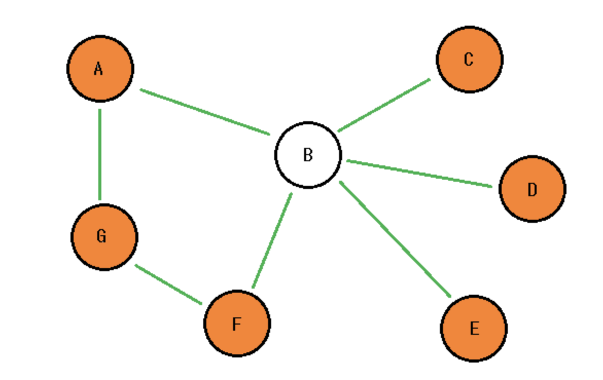
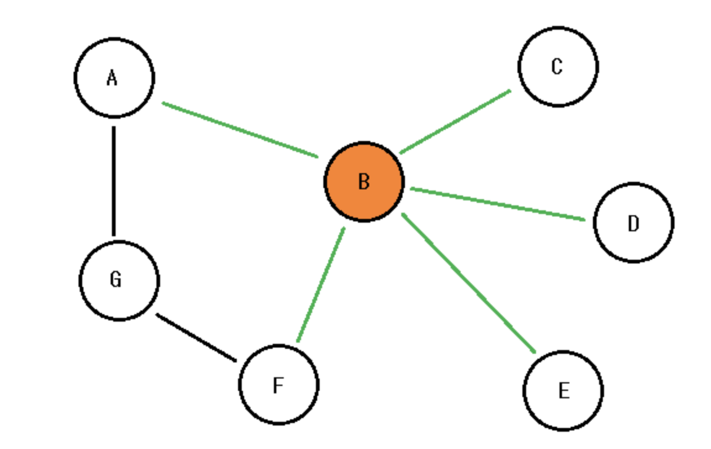
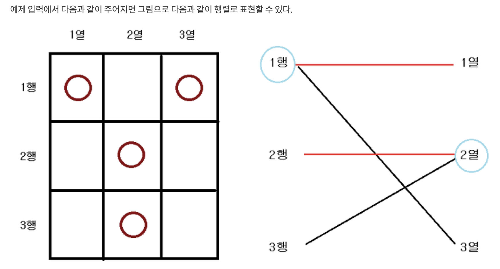

# 쾨닉의 정리
- 최소 버텍스 커버 라는 이름도 유명

## 내용
- 이분 그래프에서 <span style="color:red">최대 매칭 문제</span>와 <span style="color:red">최소 버텍스 커버 문제</span>의 답이 같다

### Minimiun Vertex Cover
- Vertex Cover : 정점 집합 S가 있을 때, __**모든 간선은 양 끝점(정점) 중 하나가 S에 포함**__ 되어야 함

  

여기서 만약 $S$ 가 $\{A, G, F, E, D, C\}$ 인 경우 해당 $S$는 Vertex Cover가 됨

  

만약 $S$ 가 $\{B\}$ 인 경우 해당 $S$는 Vertex Cover 가 될 수가 없음  
그림 상 검은 선 부분이 해당 간선과 연결된 정점이 $S$에 포함되지 않아서

- <span style="color:red">Minimun Vertex Cover </span> :
정점 $S$ 가 있을 때 모든 간선이 **적어도** 양 끝점 중 하나가 $S$에 포함되어야 할 때 그 최소 크기의 $S$ 

### 최대 독립 집합  (Maximun Independent Set)


어떤 그래프 G의 정점들의 집합을 S라고 하자. 이러한 S의 부분 집합 S`을 선택하였을 때, 각 정점들이 인접하지 않는다면 이를 Independent Set(독립 집합) 이라고 부른다.   

이 때, <span style="color:orange">최대로의 정점을 뽑아서 Independent Set을 만드는 것</span>을 Maximum Independent Set이라고 한다.

Maximum Independent Set의 특징중 하나 : **Minimum Vertex Cover의 여집합이 Maximum Independent Set 이라는 것**

즉 Maximum Independent Set + Minimiun Vertex Cover = $S$


## 쾨닉의 정리 내용
**이분 매칭** 을 통해서 Minimiun Vertex Cover 를 구할 수 있음!


# 예시문제

Vertex Cover인지 아닌지 잘 봐야함
-> 정점 집합 S가 있을 때, **모든 간선은 양 끝점중 적어도 하나가 S에 포함되게 해야함**   
이것을 응용해야 하면 이분탐색으로 풀 수 있음

## 1867 _ 돌맹이 제거

[돌맹이 제거 - 문제링크](https://www.acmicpc.net/problem/1867)

1행을 선택하면 그 행에 있는 돌 위치들의 열에 영향을 끼치는 형태임



따라서 돌 위치에서 행을 left node, 열을 right node  
이렇게 두고 연결 관계를 만들면 이분 매칭이 됨  
최대 이분 매칭 == Minimun Vertex Cover  

```c++
#include <iostream>
#include <vector>
#include <cstring>
using namespace std;

int n, k;
vector<int> adj[501];
bool v[501];
int assign[501];

bool dfs(int x) {
    for (int &nxt : adj[x]) {
        if (v[nxt]) continue;
        v[nxt] = true;

        if ( !assign[nxt] || dfs(assign[nxt]) ) {
            assign[nxt] = x;
            return true;
        }
    }
    return false;
}

int main(void) {
    ios_base::sync_with_stdio(false); cin.tie(0); cout.tie(0);
    cin >> n >> k;

    for (int i = 0; i < k; ++i) {
        // 행 열 입력
        int r, c; cin >> r >> c;

        // 어떤 행을 선택할 때 영향 미치는 열 연결하기
        adj[r].push_back(c);
    }

    // 이분 매칭 , 이 결과 == Mininum Vertex Cover
    int ans = 0;
    for (int i= 1;i <=n; ++i) {
        memset(v, 0, sizeof(v));
        ans += dfs(i);
    }

    cout << ans;
    return 0;
}

```