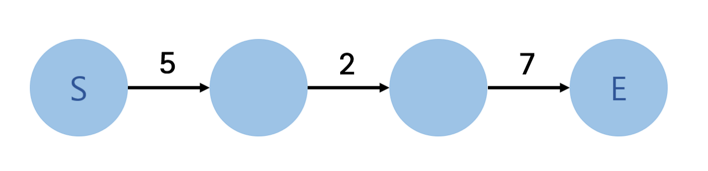
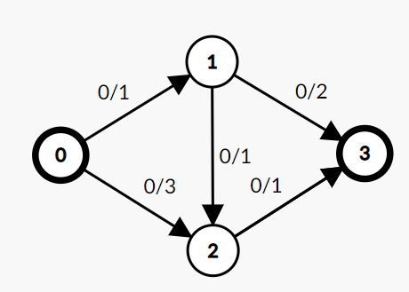
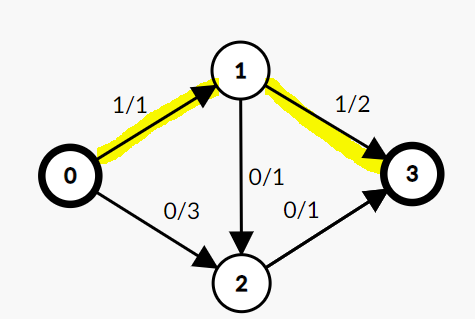
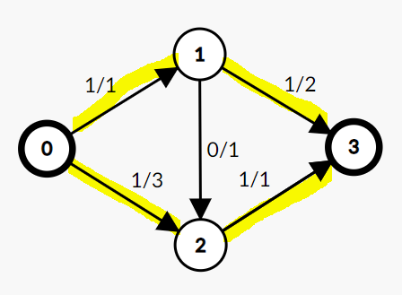
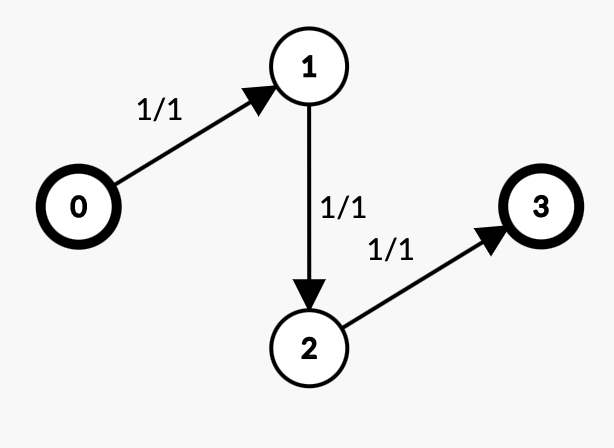
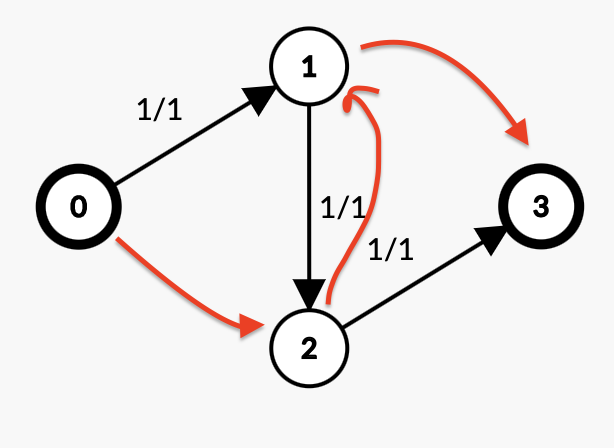
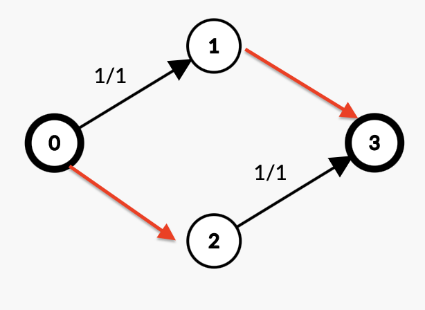
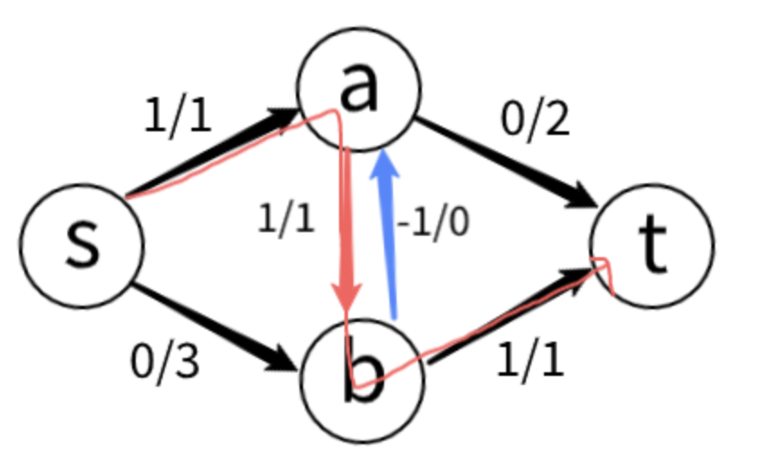
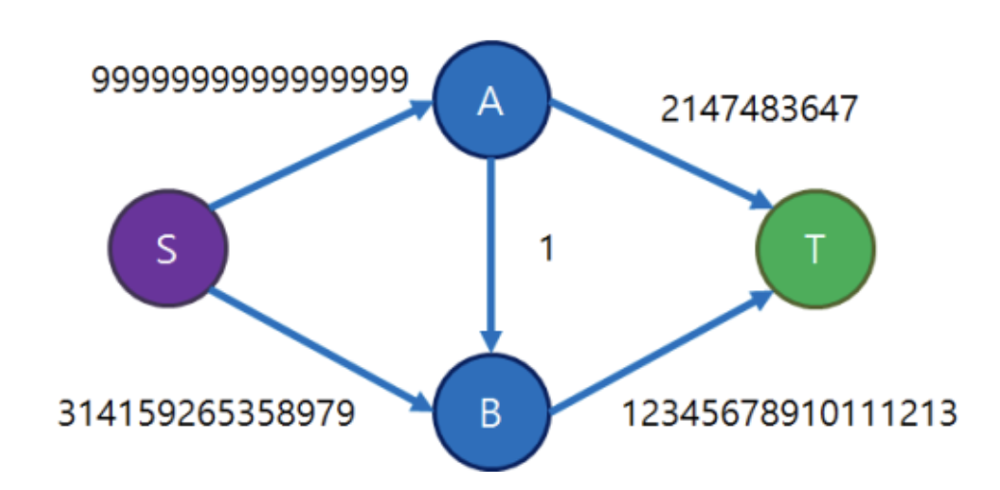
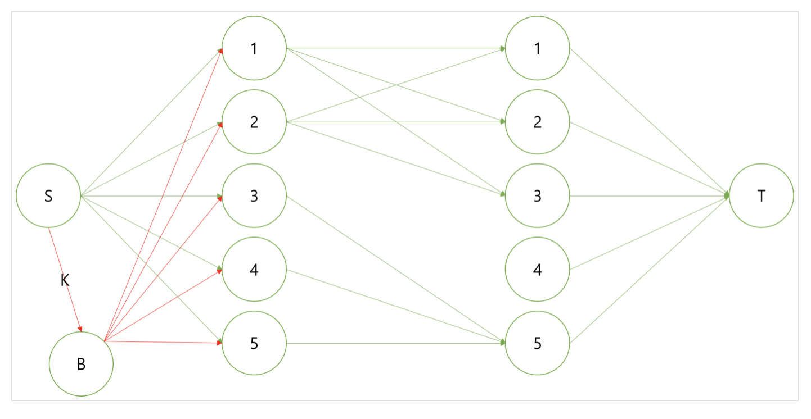

# [네트워크 유량] Network Flow(최대 유량)
- 그래프에서 두 정점 사이에 얼마나 많은 유량을 보낼 수 있는가?  
- 이는 어느 시작점에서 도착점까지 얼마나 많이 보낼 수 있는가? (대역폭 느낌)

## 용어
**용량(Capacity)**
- c(u, v)는 정점 u에서 v로 가는 간선의 용량(가중치)

**유량(Flow)**
- f(u, v)는 정점 u에서 v로의 간선에 실제로 흐르는 유량을 의미

**잔여 용량(Residual Capacity)**
- 간선의 용량과 유량의 차이를 의미.  r(u, v) = c(u, v) - f(u, v)  
  즉, 해당 간선에 추가적으로 더 흘려 보낼 수 있는 유량

**소스(source)**
- 유량이 시작되는 정점으로. 즉 시작정점

**싱크(sink)**
- 모든 유량이 도착하는 정점이 싱크 즉 종점
네트워크 유량 알고리즘은 소스에서 싱크로 흐를 수 있는 최대 유량을 계산


## 이해

여기서 S 가 Source, E가 Sink이라고 할 때  
S -> E 갈 수 있는 최대 유량은 2밖에 안됨    

만약 Cost 문제였으면 총 비용은 14가 되는 것

<br>
<br>

# 알고리즘
기본적으로 $O(V \times E^2)$ 만큼의 복잡도를 가지는 알고리즘들

## 규칙
- 용량의 제한 : 유량은 그 간선의 용량을 초과할 수 없음
- 유량의 보존 : Source, Sink를 제외하고, 모든 정점에서 "들어오는 유량" 과 나가는 유량은   
  무조건 같음

- 유량의 대칭성 : u -> v 로 f만큼의 유량이 흐르면 u -> v 로 -f 만큼의 유량이 흐른다고 가정 (방향성)

- Value of Flow : 소스에서 나오는 유량의 크기는 모두 싱크로 흘러가는 유량의 크기와 같다

**Maximun Flow problem 은 이 Value of Flow의 최대값을 찾는 것이다**

- 유량을 발생시킬 수 있는 건 소스 정점 뿐이고, 그 외의 정점들은 자신이 받은 유량만큼만 다시 흘려보낼 수 있음

기본적으로 아래 2개 알고리즘은 
<span style="color:red"><b>증가 경로를 "어떻게든" 찾은 후 그 쪽으로 flow를 보내주는 방식으로 해결</b></span>

[상세한 설명 블로그](https://blog.naver.com/PostView.nhn?blogId=kks227&logNo=220804885235)

## 포드-풀커슨 알고리즘(Ford–Fulkerson Algorithm)

- 모든 간선의 "유량"을 0으로 시작하고,  
소스에서 싱크로의 경로 중 유량을 늘릴 수 있는 경로를 찾아 유량을 흘러보내기를 반복함 

이때 유량을 흘러 보내기 위해서 찾은 경로를 "증가 경로" 라고 부름

1. 모든 유량을 0으로 두기  

<br>

2. 소스에서 싱크로 유량을 더 보낼 수 있는 경로를 찾아 유량을 보내기 반복하기   
이렇게 유량을 보내는 경로를 "증가 경로" 라고 부름 
<br>
<div display="flex">


</div>

- 유량의 크기를 지정을 하고, Source 에서 항상 그만큼 그 유랑만큼 보낸다고 생각하기  
- 유량을 흘러 보낼 때, 도중에 멈춰서 안되고 반드시 Sink에 도달해야 함
- 일단 증가 경로를 지정할 경우, 그 증가 경로의 최대로 보낼 수 있는 유량크기는  
해당 지정된 간선에서 <span style="color:red">"잔여 용량"의 최소 값임.</span>


(위의 그림에서 0-1-3 에서 1-3은 2의 유량을 더 보낼 수 있지만 0-1로는 1의 유량만 보낼 수 있으므로 0-1-3은 최대 1의 유량만 보낼 수 있다.)

포드 폴커슨 알고리즘은 이와 같은 증가 경로가 더 이상 존재하지 않을 때까지 증가 경로를 찾고,  
보낼 수 있는 최대 유량을 해당 경로를 따라 보내는 작업을 반복한다.  
이 증가 경로를 찾는 과정은 그래프의 탐색 알고리즘을 이용하면 쉽게 구현가능

단 어떤 증가 경로을 먼저 탐색하는가에 따라 다음과 같은 경우가 발생  
  

이 경우 더이상 유효한 잔여 용량이 남지 않아서 더이상 탐색이 되지 않음.

따라서 **음의 가중치** 개념이 들어감(유량의 대칭성)
<div display="flex">
  

</div>  
<div display="flex">

</div> 
이를 통해서 해당 방향으로 "잔여 용량" 이 남게되어 해당 방향으로 증가 경로로 탐색이 가능해짐  

(가면 대신 유량 처리는 반대쪽 방향처리 주의하기)
<hr>

**시간복잡도** $O(Ef)$  , $f$ : 유량  
매번 유량크기를 일단 지정하고 탐색하는 꼴이라서 최악인 경우가 항상 존재


이런 경우가 대표적임

<br>


# 에드몬드 카프 알고리즘(Edmonds-Karp algorithm)

위의 포드 - 폴커슨 알고리즘을 BFS로 구현하는 것.  
이 알고리즘을 사용하면 $min(O(E \times f), \space O(VE^2))$ 의 시간복잡도 가짐

밑의 코드는 그래프를 $V^2$ 형태인 배열을 이용해서 구현된 것  

```c++
int capacity[MAXN][MAXN], flow[MAXN][MAXN];
 
//source: 시작 지점, sink: 목적 지점
int MaximumFlow(int source, int sink){
  memset(capacity, 0 , sizeof(capacity));
  memset(flow, 0, sizeof(flow));
  int total_flow;
 
  while(1){
    vector<int> parent(MAXN, -1);
    queue<int> q;
    parent[source] = source;
    q.push(source);
 
    //최단으로 sink로 도달하는 경로 찾기
    while(!q.empty() && parent[sink] == -1){
      int here = q.front();
      q.pop();
 
      for(int there =0; there<MAXN ; ++there)
        if(capacity[here][there] - flow[here][there] > 0 && parent[there] == -1){
          q.push(there);
          parent[there] = here;
        }
    }
 
    //sink까지의 경로를 못 찾았다면 더이상 증가 경로가 없음
    if(parent[sink] == -1)
      break;
 
    // 증가 경로로 새로 흘려줄 유량 = 경로 중 최소 잔여 용량
    int amount = INF;
    for(int p = sink ; p != source  ; p = parent[p])
      amount = min(capacity[parent[p]][p] - flow[parent[p]][p], amount);
    
    //증가 경로는 유량 증가, 역 방향 경로는 유량 감소
    for(int p = sink ; p != source  ; p = parent[p]){
      flow[parent[p]][p] += amount;
      flow[p][parent[p]] -= amount;
    }
 
    total_flow += amount;
  }
 
  return total_flow;
}

```

만약 $V$ 가 너무 큰 경우 어쩔수 없이 간선을 구현해야함  
- 주의점 : "역방향 간선"을 넣어 두어야 한다!

```c++
#include <cstdio>
#include <vector>
#include <queue>
#include <algorithm>
using namespace std;
const int MAX_V = 52;
const int INF = 1000000000;
 
// 간선 구조체
struct Edge{
    int to, c, f;
    Edge *dual; // 자신의 역방향 간선을 가리키는 포인터
    Edge(): Edge(-1, 0){}
    Edge(int to1, int c1): to(to1), c(c1), f(0), dual(nullptr){}
    int spare(){
        return c - f;
    }
    void addFlow(int f1){ // 자신과 역방향 간선에 f1만큼의 플로우 값을 갱신
        f += f1;
        dual->f -= f1;
    }
};
 
inline int CtoI(char c){
    if(c <= 'Z') return c - 'A';
    return c - 'a' + 26;
}
 
int main(){
    int N;
    vector<Edge*> adj[MAX_V]; // 존재하는 간선만을 인접 리스트로 저장
    // 간선 정보 입력받음
    scanf("%d", &N);
    for(int i=0; i<N; i++){
        char u, v;
        int w;
        scanf(" %c %c %d", &u, &v, &w);
        u = CtoI(u); v = CtoI(v);
        Edge *e1 = new Edge(v, w), *e2 = new Edge(u, 0);
        e1->dual = e2;
        e2->dual = e1;
        adj[u].push_back(e1);
        adj[v].push_back(e2);
    }
 
    int total = 0, S = CtoI('A'), E = CtoI('Z');
    while(1){
        int prev[MAX_V];
        Edge *path[MAX_V] = {0}; // 경로상의 간선들을 저장해두어 나중에 참조
        fill(prev, prev+MAX_V, -1);
        queue<int> Q;
        Q.push(S);
        while(!Q.empty() && prev[E] == -1){
            int curr = Q.front();
            Q.pop();
            for(Edge *e: adj[curr]){
                int next = e->to;
                if(e->spare() > 0 && prev[next] == -1){
                    Q.push(next);
                    prev[next] = curr;
                    path[next] = e;
                    if(next == E) break;
                }
            }
        }
        if(prev[E] == -1) break;
 
        int flow = INF;
        for(int i=E; i!=S; i=prev[i])
            flow = min(flow, path[i]->spare());
        for(int i=E; i!=S; i=prev[i])
            path[i]->addFlow(flow);
        total += flow;
    }
    printf("%d\n", total);
}
[출처] 네트워크 유량(Network Flow) (수정: 2019-08-14)|작성자 라이

```
간선을 정의 할때 역방향도 함께 정의하는 것, 그릭 역방향 간선을 가능한 빨리 참조하기  


+ 무방향 그래프인 경우 정, 역 뱡항 전부 초기 전부 양쪽 용량을 같은 값으로 초기화 하면 됨


---

# 문제 예시

## 열형강호 3 & 4 - 유량 풀이법

 <br> 
사진으로 모든걸 설명 할 수 있음

---

# 디닉 알고리즘 (Dinic's Algorithm)

시간 복잡도 : $O(min(Ef, V^2E))$

## 용어

- **레벨 그래프**  :  
모든 정점에 대해 소스에서 부터 최단 거리(즉 거쳐야 하는 간선 개수)  
소스를 0으로 두면 그 주변은 1, 또 그 주변은 2... 값을 가짐  
**"단 여유 용량"** 이 없는 간선은 취급을 안하고 탐색함

- **차단 유량 (Blocking Flow)** :  
레벨 그래프 에서는 원래의 그래프에서 간선이 존재하더라도  
(u - v) , v 레벨이 u 레벨 보다 정확히 1 이 커야만 이동 가능  
즉, 항상 인접하면서 자신보다 레벨이 1 큰 정점으로만 이동 가능하다. 이런 그래프에서 더 이상 소스에서 싱크로 흘릴 수 있는 유량이 없게 만드는 유량 상태.

설명 : [자세한 설명](https://m.blog.naver.com/kks227/220812858041)

```c++
#include <cstdio>
#include <vector>
#include <stack>
#include <queue>
#include <algorithm>
using namespace std;
const int MAX_N = 500;
const int MAX_V = MAX_N+2;
const int S = MAX_V-2;
const int E = MAX_V-1;
const int INF = 1000000000;
 
int N, c[MAX_V][MAX_V], f[MAX_V][MAX_V];
int level[MAX_V]; // 레벨 그래프에서 정점의 레벨(S가 0)
int work[MAX_V]; // dfs 중, 이 정점이 몇 번째 간선까지 탐색했는지 기억하는 용도
vector<int> adj[MAX_V];
 
// 디닉 전용 bfs 함수
bool bfs(){
    // 레벨값 초기화
    fill(level, level+MAX_V, -1);
    level[S] = 0;
    
    queue<int> Q;
    Q.push(S);
    while(!Q.empty()){
        int curr = Q.front();
        Q.pop();
        for(int next: adj[curr]){
            // 레벨값이 설정되지 않았고, 간선에 residual이 있을 때만 이동
            if(level[next] == -1 && c[curr][next]-f[curr][next] > 0){
                level[next] = level[curr] + 1; // next의 레벨은 curr의 레벨 + 1
                Q.push(next);
            }
        }
    }
    // 싱크에 도달 가능하면 true, 아니면 false를 리턴
    return level[E] != -1;
}

// 디닉 전용 dfs 함수: curr에서 dest까지 최대 flow만큼의 유량을 보낼 것
int dfs(int curr, int dest, int flow){
    // base case: dest에 도달함
    if(curr == dest) return flow;
 
    // 현재 정점에서 인접한 정점들을 탐색
    // 이때, 이번 단계에서 이미 쓸모없다고 판단한 간선은 다시 볼 필요가 없으므로
    // work 배열로 간선 인덱스를 저장해 둠
    for(int &i=work[curr]; i<adj[curr].size(); i++){
        int next = adj[curr][i];
        // next의 레벨이 curr의 레벨 + 1이고, 간선에 residual이 남아있어야만 이동
        if(level[next] == level[curr]+1 && c[curr][next]-f[curr][next] > 0){
            // df: flow와 다음 dfs함수의 결과 중 최소값
            // 결과적으로 경로상의 간선들 중 가장 작은 residual이 됨
            int df = dfs(next, dest, min(c[curr][next]-f[curr][next], flow));
            // 증가 경로가 있다면, 유량을 df만큼 흘리고 종료
            if(df > 0){
                f[curr][next] += df;
                f[next][curr] -= df;
                return df;
            }
        }
    }
    // 증가 경로를 찾지 못함: 유량 0 흘림
    return 0;
}

int main(void) {

  // 그래프 연결 및 입력 부분은 스킵

  // 디닉 알고리즘 수행
  int total = 0;
  // 레벨 그래프를 구축하여 싱크가 도달 가능한 동안 반복
  while(bfs()){
      fill(work, work+MAX_V, 0);
      // 차단 유량(blocking flow) 구하기
      while(1){
          int flow = dfs(S, E, INF); // dfs를 사용해 각 경로를 찾음
          if(flow == 0) break; // 더 이상 경로가 없으면 종료
          total += flow; // 총 유량에 이번에 구한 유량 더함
      }
  }

   printf("%d\n", total);


}


```

이때 중점을 두고 봐야할 코드는 work 배열이

```c++
for (int &i = work[here]; i < adj[here].size(); i++)
```

i는 work[here]을 참조하고 있게되고 i가 증가할때마다 i가 work[here]을 참조하니 work[here]의 값도 +1씩 증가하게 된다.

이 의미는 만약 어떤 레벨그래프 차단 유량에서 S->1->2->T로 유량을 흘려보냈다고 생각해보자.  
(S->1 은 5/100, 1->2는 5/100, 2->T는 5/5의 flow/capacity를 보냈다고 생각해보자.) 
 
그러면 그다음 또 유량을 흘려 보낼 때 같은 레벨 그래프내에서는 S->1->2->T는 이미 최대 유량을 흘려보냈을 것이고,  
2->T는 5/5 즉, 유량을 최대로 보낸 상태이기에 이 간선을 통해서 보낼 수 있는 유량은 더이상 없다는게 자명해진다.  
이러한 것을 메모하기 위해 work배열이 생성된 것이고, work배열은 현재 노드가 몇번째 간선부터 보면 될지 파악해주는 역할을 하게 된다  

---

# 최대 유량 최소 컷 정리

## 용어 

Cut : 어느 한 그래프를 2개의 Connected Component로 구성하기 위한 비용  
- 가중치가 없는 경우, 자른 간선의 개수  
- 가중치가 있는 경우 : 자른 간선의 가중치의 총 합

## Min - Cut
Cut 중에서 비용이 가장 최소인 것  
- 가중치가 없는 경우, 자른 간선의 개수 가 최소인 경우
- 가중치가 있는 경우 : 자른 간선의 가중치의 총 합이 가장 작은 경우  

## Max_Flow Min_Cut 이론  
**Min_Cut의 값은 Max_Flow값과 동일하다**

## Min_Cut 그룹, 간선 찾기

간단함. Max_Flow를 구하고 나서  
또 추가적으로 Source에서 추가 유량을 흘러보내주면 됨  
- 이때 Source에서 추가 유량을 받을 수 있는 그룹과 못 받는 그룹으로 나눌 수 있음  
- 또 u 까진 도달 가능하고 u -> v로 가는데 추가 유량을 보내지 못하면 그 간선이 곧 Min_Cut 되는 간선이다.

## 블로그들

https://restudycafe.tistory.com/430
