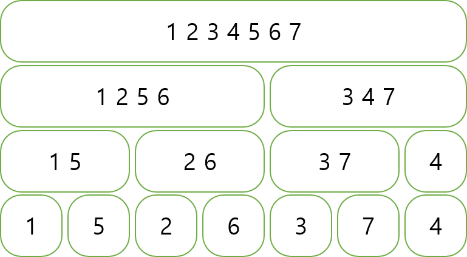

# 머지 소트 트리  

이름 그대로 머지 소트를 기반으로 한 트리  
쉽게 말하면 " 각 노드가 한 값이 아닌 리스트를 갖고 있는 세그먼트 트리" 라고 표현 가능  
자신의 의미하는 구간에 들어있는 모든 값들을 정렬한 형태로 들고 있음.  
(보통은 중복한 값도 다 들고 있음)  

  

## 구현  
마치 세그먼트 트리 구현 하듯히 하면 됨  
$i$ 번째 리프 노드에 $a_i$ 원소를 넣고 bottom_up 방식으로 두 노드를 합치면서 merge 하면 끝.  

c++ 에선 STL의 merge 함수를 사용하면 되고  
다른 알고리즘에선 투 포인터를 이용해서 merge를 구현하면 됨  

```c++
#define all(v) v.begin(), v.end()
const int sz = 1 << 17;
vector<T> tree[sz*2];
void add(int x, T v){
  x += sz; tree[x].push_back(v);
}
void build(){
  for(int i=1; i<=n; i++) add(i, a[i]);
  for(int i=sz-1; i; i--){
    tree[i].resize(tree[i*2].size() + tree[i*2+1].size()); //merge함수를 사용하기 위해서는 공간을 미리 할당해야함
    merge(all(tree[i*2]), all(tree[i*2+1]), tree[i].begin()); //정렬된 두 개의 배열을 졍렬된 상태로 병합
  }
}
```

```c++
// 머지 소트 트리
struct MergesortTree{
    // 각 노드가 리스트를 담고 있음
    vector<int> arr[MAX_ST];
 
    // 리프 노드들만 채워진 상태에서 구축하는 함수
    void construct(){
        for(int i = MAX_ST/2-1; i > 0; --i){
            vector<int> &c = arr[i], &l = arr[i*2], &r = arr[i*2+1];
            arr[i].resize(l.size()+r.size());
            for(int j = 0, p = 0, q = 0; j < c.size(); ++j){
                if(q == r.size() || (p < l.size() && l[p] < r[q])) c[j] = l[p++];
                else c[j] = r[q++];
            }
        }
    }
 
    // 구간 [s, e) 사이에서 k보다 큰 값의 개수를 돌려줌
    int greater(int s, int e, int k, int node = 1, int ns = 0, int ne = MAX_ST/2){
        // 자신이 완전히 구간 밖
        if(ne <= s || e <= ns) return 0;
        // 자신이 완전히 구간 안: 이 노드의 결과를 돌려줌
        if(s <= ns && ne <= e)
            return arr[node].end() - upper_bound(arr[node].begin(), arr[node].end(), k);
 
        // 자신의 양쪽 노드의 답을 구해 더해서 돌려줌
        int mid = (ns+ne)/2;
        return greater(s, e, k, node*2, ns, mid) + greater(s, e, k, node*2+1, mid, ne);
    }
};

```