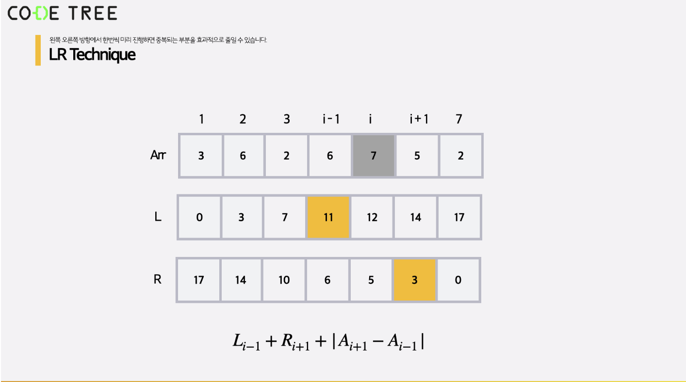

# LR Tech  

다음과 같은 질문에 적절할 수 있는 기술  

```
[3, 6, 2, 6, 7, 5, 2] 와 같이 숫자들이 주어졌을 때,
다음 질의에 대해 답하는 프로그램을 작성해보세요.

단, 질의마다 하나의 숫자가 주어지며 
해당 번째 숫자를 제외한
다른 숫자들에 대해 인접한 숫자간의 차이의 합을 구해야 합니다.

예를 들어 질의로 5가 주어졌다면
5번째 숫자인 7을 제외한 다른 숫자들을 나열하면
[3, 6, 2, 6, 5, 2]가 되므로
인접한 숫자간의 차이의 합은
|3 - 6| + |6 - 2| + |2 - 6| + |6 - 5| + |5 - 2| = 15가 됩니다.

이때 주어지는 숫자는 1초과 N 미만임을 가정해도 좋습니다.
```

이 기술은 왼쪽으로 누적합, 오른쪽으로 누적합 을 이용하는 테크닉  


